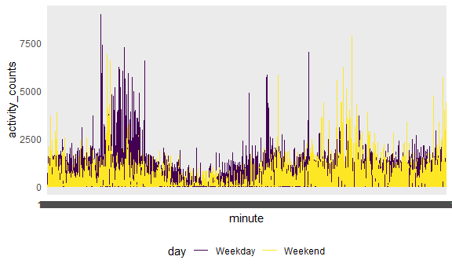
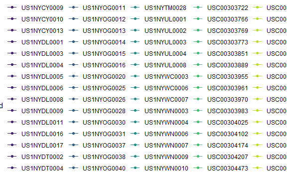
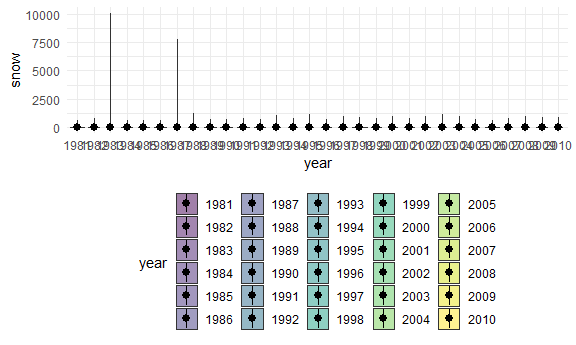

p8105\_hw3\_ep2899
================

``` r
library(tidyverse)
```

    ## -- Attaching packages ----------------------------------------------------------- tidyverse 1.3.0 --

    ## v ggplot2 3.3.2     v purrr   0.3.4
    ## v tibble  3.0.3     v dplyr   1.0.2
    ## v tidyr   1.1.2     v stringr 1.4.0
    ## v readr   1.3.1     v forcats 0.5.0

    ## -- Conflicts -------------------------------------------------------------- tidyverse_conflicts() --
    ## x dplyr::filter() masks stats::filter()
    ## x dplyr::lag()    masks stats::lag()

``` r
library(p8105.datasets)


knitr::opts_chunk$set(
  fig.width = 6,
  fig.asp = 0.6,
  out.width= "90%"
)


theme_set(theme_minimal() + theme(legend.position = "bottom"))
          

options(
    ggplot2.continuous.colour= "viridis" ,
    ggplot2.continuous.fill = "viridis"
)        


scale_colour_discrete = scale_color_viridis_d
scale_fill_discrete = scale_fill_viridis_d
```

\#\#\#Problem 0 This “problem” focuses on structure of your submission,
especially the use git and GitHub for reproducibility, R Projects to
organize your work, R Markdown to write reproducible reports, relative
paths to load data from local files, and reasonable naming structures
for your files.

### Problem 1

``` r
data("instacart")
```

This dataset contains ‘r nrow(instacart)’ rows and … columns

Observations are the level of items in orders by user. There are
user/order variables – user ID, order ID, order day, and order hour.
There are also item variables – name, aisle, department, and same
numeric codes.

how many aisles, and which are most items from?

``` r
instacart %>% 
  count(aisle) %>% 
  arrange(desc(n))
```

    ## # A tibble: 134 x 2
    ##    aisle                              n
    ##    <chr>                          <int>
    ##  1 fresh vegetables              150609
    ##  2 fresh fruits                  150473
    ##  3 packaged vegetables fruits     78493
    ##  4 yogurt                         55240
    ##  5 packaged cheese                41699
    ##  6 water seltzer sparkling water  36617
    ##  7 milk                           32644
    ##  8 chips pretzels                 31269
    ##  9 soy lactosefree                26240
    ## 10 bread                          23635
    ## # ... with 124 more rows

Let’s make a plot

``` r
instacart %>% 
  count(aisle) %>% 
  filter(n > 10000) %>% 
  mutate(
    aisle = factor(aisle),
    aisle = fct_reorder(aisle, n)
  ) %>% 
  ggplot(aes (x = aisle, y=n)) +
  geom_point() +
  theme(axis.text.x = element_text(angle =90, vjust = 0.5, hjust =1))
```


Let’s make a table\!

``` r
instacart %>% 
  filter (aisle %in% c("baking ingredients", "dog food care", "packaged vegetables fruits") ) %>% 
    group_by(aisle) %>% 
count(product_name) %>% 
  mutate(rank = min_rank(desc(n))) %>% 
  filter (rank <4) %>% 
  arrange(aisle, rank) %>% 
  knitr::kable()
```

| aisle                      | product\_name                                 |    n | rank |
| :------------------------- | :-------------------------------------------- | ---: | ---: |
| baking ingredients         | Light Brown Sugar                             |  499 |    1 |
| baking ingredients         | Pure Baking Soda                              |  387 |    2 |
| baking ingredients         | Cane Sugar                                    |  336 |    3 |
| dog food care              | Snack Sticks Chicken & Rice Recipe Dog Treats |   30 |    1 |
| dog food care              | Organix Chicken & Brown Rice Recipe           |   28 |    2 |
| dog food care              | Small Dog Biscuits                            |   26 |    3 |
| packaged vegetables fruits | Organic Baby Spinach                          | 9784 |    1 |
| packaged vegetables fruits | Organic Raspberries                           | 5546 |    2 |
| packaged vegetables fruits | Organic Blueberries                           | 4966 |    3 |

Apples vs ice cream..

``` r
instacart %>% 
  filter(product_name %in% c("Pink Lady Apples", "Coffee Ice Cream")) %>% 
  group_by(product_name, order_dow) %>% 
  summarize(mean_hour=mean(order_hour_of_day)) %>% 
  pivot_wider(
    names_from = order_dow,
    values_from = mean_hour
  )
```

    ## `summarise()` regrouping output by 'product_name' (override with `.groups` argument)

    ## # A tibble: 2 x 8
    ## # Groups:   product_name [2]
    ##   product_name       `0`   `1`   `2`   `3`   `4`   `5`   `6`
    ##   <chr>            <dbl> <dbl> <dbl> <dbl> <dbl> <dbl> <dbl>
    ## 1 Coffee Ice Cream  13.8  14.3  15.4  15.3  15.2  12.3  13.8
    ## 2 Pink Lady Apples  13.4  11.4  11.7  14.2  11.6  12.8  11.9

\#\#Problem 2 Load, Tidy, Wrangle Data

``` r
accel_df=
 read_csv("./data/accel_data.csv") %>% 
  pivot_longer(
    activity.1:activity.1440, 
    names_to = "minute", 
    names_prefix = "activity.",
    values_to = "activity_counts"
  ) %>% 
  mutate(
    day= recode(day, Monday = "Weekday", Tuesday = "Weekday" , Wednesday = "Weekday" , Thursday = "Weekday" , Friday= "Weekday",  Saturday = "Weekend", Sunday = "Weekend")
  )
```

    ## Parsed with column specification:
    ## cols(
    ##   .default = col_double(),
    ##   day = col_character()
    ## )

    ## See spec(...) for full column specifications.

``` r
accel_df %>% 
    mutate(minute = as.numeric(minute)) %>% 
  count(minute)
```

    ## # A tibble: 1,440 x 2
    ##    minute     n
    ##     <dbl> <int>
    ##  1      1    35
    ##  2      2    35
    ##  3      3    35
    ##  4      4    35
    ##  5      5    35
    ##  6      6    35
    ##  7      7    35
    ##  8      8    35
    ##  9      9    35
    ## 10     10    35
    ## # ... with 1,430 more rows

Describe dataset: This accel\_df contains 4 different numeric variables
(week, day\_id, minute of day, and activity counts) and 1 character
variable (day). There are a total of 1,440 separate minute of day
observations.

Aggregate across minutes to create a total activity variable for each
day, and create a table showing these totals. Are any trends apparent?
Highest sum activity was recorded on the 35th weekday and 32nd weekend.

``` r
accel_df %>% 
group_by(day, day_id) %>% 
  summarize(activity_sum = sum(activity_counts)) %>% 
   mutate(rank = min_rank(desc(day_id))) %>% 
  arrange(day_id, rank) %>% 
  knitr::kable()
```

    ## `summarise()` regrouping output by 'day' (override with `.groups` argument)

| day     | day\_id | activity\_sum | rank |
| :------ | ------: | ------------: | ---: |
| Weekday |       1 |     480542.62 |   25 |
| Weekday |       2 |      78828.07 |   24 |
| Weekend |       3 |     376254.00 |   10 |
| Weekend |       4 |     631105.00 |    9 |
| Weekday |       5 |     355923.64 |   23 |
| Weekday |       6 |     307094.24 |   22 |
| Weekday |       7 |     340115.01 |   21 |
| Weekday |       8 |     568839.00 |   20 |
| Weekday |       9 |     295431.00 |   19 |
| Weekend |      10 |     607175.00 |    8 |
| Weekend |      11 |     422018.00 |    7 |
| Weekday |      12 |     474048.00 |   18 |
| Weekday |      13 |     423245.00 |   17 |
| Weekday |      14 |     440962.00 |   16 |
| Weekday |      15 |     467420.00 |   15 |
| Weekday |      16 |     685910.00 |   14 |
| Weekend |      17 |     382928.00 |    6 |
| Weekend |      18 |     467052.00 |    5 |
| Weekday |      19 |     371230.00 |   13 |
| Weekday |      20 |     381507.00 |   12 |
| Weekday |      21 |     468869.00 |   11 |
| Weekday |      22 |     154049.00 |   10 |
| Weekday |      23 |     409450.00 |    9 |
| Weekend |      24 |       1440.00 |    4 |
| Weekend |      25 |     260617.00 |    3 |
| Weekday |      26 |     340291.00 |    8 |
| Weekday |      27 |     319568.00 |    7 |
| Weekday |      28 |     434460.00 |    6 |
| Weekday |      29 |     620860.00 |    5 |
| Weekday |      30 |     389080.00 |    4 |
| Weekend |      31 |       1440.00 |    2 |
| Weekend |      32 |     138421.00 |    1 |
| Weekday |      33 |     549658.00 |    3 |
| Weekday |      34 |     367824.00 |    2 |
| Weekday |      35 |     445366.00 |    1 |

Make a single-panel plot that shows the 24-hour activity time courses
for each day and use color to indicate day of the week. Describe in
words any patterns or conclusions you can make based on this graph.

``` r
accel_df %>% 
ggplot(aes(x = minute, y = activity_counts, color = day))+
  geom_line()
```


Activity counts appear to peak during certain minute windows of the day
(with weekdays peaking more than weekends).

\#\#Problem 3

``` r
library(p8105.datasets)
data("ny_noaa")
```

Write a short description of the dataset, noting the size and structure
of the data, describing some key variables, and indicating the extent to
which missing data is an issue

This dataset consists of 7 columns and 2,595, 176 rows. Observations are
listed by weather station ID and chronologically by date. Numeric
variables include precipitation in tenths of mm, snowfall in mm, snow
depth in mm. Character variables include maximum and minimum temperature
in tenths of degrees C. Due to the fact that each weather station can
only collect parts of this information, there is substantial missing
data.

Create separate variables for year, month, and day. Ensure observations
for temperature, precipitation, and snowfall are given in reasonable
units. For snowfall, what are the most commonly observed values? Why?

``` r
ny_noaa_df=
separate(ny_noaa, date, into = c("year", "month" , "day" ))
```

``` r
ny_noaa_df %>%   
mutate(
    tmin = as.numeric(tmin),
    tmax = as.numeric(tmax),
    tmin = tmin/10,
    tmax= tmax/10
  )
```

    ## # A tibble: 2,595,176 x 9
    ##    id          year  month day    prcp  snow  snwd  tmax  tmin
    ##    <chr>       <chr> <chr> <chr> <int> <int> <int> <dbl> <dbl>
    ##  1 US1NYAB0001 2007  11    01       NA    NA    NA    NA    NA
    ##  2 US1NYAB0001 2007  11    02       NA    NA    NA    NA    NA
    ##  3 US1NYAB0001 2007  11    03       NA    NA    NA    NA    NA
    ##  4 US1NYAB0001 2007  11    04       NA    NA    NA    NA    NA
    ##  5 US1NYAB0001 2007  11    05       NA    NA    NA    NA    NA
    ##  6 US1NYAB0001 2007  11    06       NA    NA    NA    NA    NA
    ##  7 US1NYAB0001 2007  11    07       NA    NA    NA    NA    NA
    ##  8 US1NYAB0001 2007  11    08       NA    NA    NA    NA    NA
    ##  9 US1NYAB0001 2007  11    09       NA    NA    NA    NA    NA
    ## 10 US1NYAB0001 2007  11    10       NA    NA    NA    NA    NA
    ## # ... with 2,595,166 more rows

``` r
ny_noaa_df %>% 
   group_by(snow) %>% 
  summarize(
    n_obs =n()
    ) %>% 
  mutate(rank = min_rank(desc(n_obs))) %>%
   arrange(n_obs, rank) %>% 
  filter(rank<3)
```

    ## `summarise()` ungrouping output (override with `.groups` argument)

    ## # A tibble: 2 x 3
    ##    snow   n_obs  rank
    ##   <int>   <int> <int>
    ## 1    NA  381221     2
    ## 2     0 2008508     1

For snowfall, the most commonly observed value is “0” mm

Make a two-panel plot showing the average max temperature in January and
in July in each station across years. Is there any
observable/interpretable structure? Any outliers?

``` r
 ny_noaa_df = 
  mutate(ny_noaa_df,
    tmin = as.numeric(tmin),
    tmax = as.numeric(tmax),
    tmin = tmin/10,
    tmax= tmax/10
  ) 
```

``` r
ny_noaa_df %>% 
  filter(month %in% c("01", "07")) %>% 
   group_by(id, year, month) %>% 
  summarize(
    mean_tmax=mean(tmax, na.rm =TRUE)) %>% 
  ggplot(aes(x=year, y= mean_tmax, group= id, color = id)) +
  geom_point() +
  geom_path()+
   facet_grid(.  ~month)
```

    ## `summarise()` regrouping output by 'id', 'year' (override with `.groups` argument)

    ## Warning: Removed 5970 rows containing missing values (geom_point).

    ## Warning: Removed 5931 row(s) containing missing values (geom_path).



Make a two-panel plot showing tmax vs tmin for the full dataset (note
that a scatterplot may not be the best option)

make a plot showing the distribution of snowfall values greater than 0
and less than 100 separately by year

``` r
  filter(ny_noaa_df, snow > 0, snow <= 100)
```

    ## # A tibble: 172,571 x 9
    ##    id          year  month day    prcp  snow  snwd  tmax  tmin
    ##    <chr>       <chr> <chr> <chr> <int> <int> <int> <dbl> <dbl>
    ##  1 US1NYAB0001 2007  11    17        3     3     0    NA    NA
    ##  2 US1NYAB0001 2007  11    24        3     3     0    NA    NA
    ##  3 US1NYAB0001 2007  11    26        8     5    NA    NA    NA
    ##  4 US1NYAB0001 2007  11    28        8     5     0    NA    NA
    ##  5 US1NYAB0001 2007  12    01       46    64    64    NA    NA
    ##  6 US1NYAB0001 2007  12    03      117    13    25    NA    NA
    ##  7 US1NYAB0001 2007  12    04       15    30    51    NA    NA
    ##  8 US1NYAB0001 2007  12    05        5     8    51    NA    NA
    ##  9 US1NYAB0001 2007  12    06        3     5    51    NA    NA
    ## 10 US1NYAB0001 2007  12    10       46     3    25    NA    NA
    ## # ... with 172,561 more rows

``` r
library(ggridges)
```

``` r
   ny_noaa_df %>% 
   ggplot(aes(x = year, y = snow, fill=year))+
   geom_violin(alpha = 0.5)+
   stat_summary(fun = "median")
```

    ## Warning: Removed 381221 rows containing non-finite values (stat_ydensity).

    ## Warning: Removed 381221 rows containing non-finite values (stat_summary).

    ## Warning: Removed 30 rows containing missing values (geom_segment).


